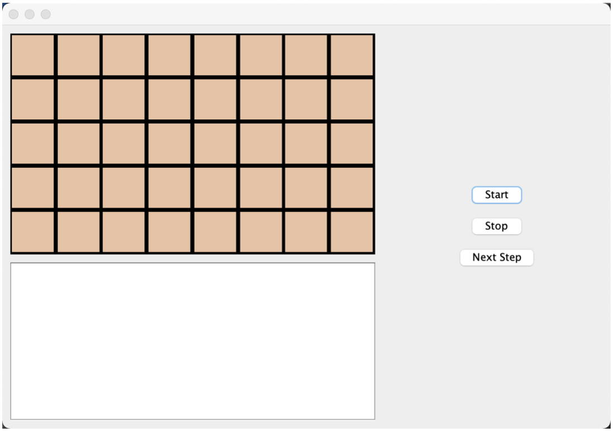
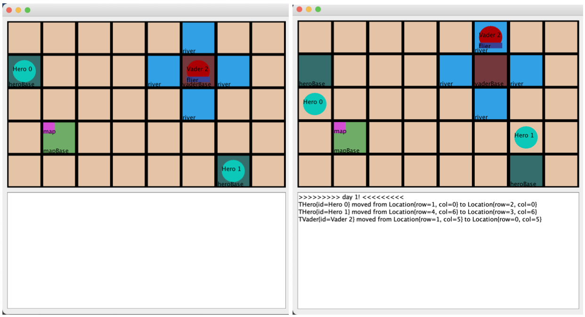
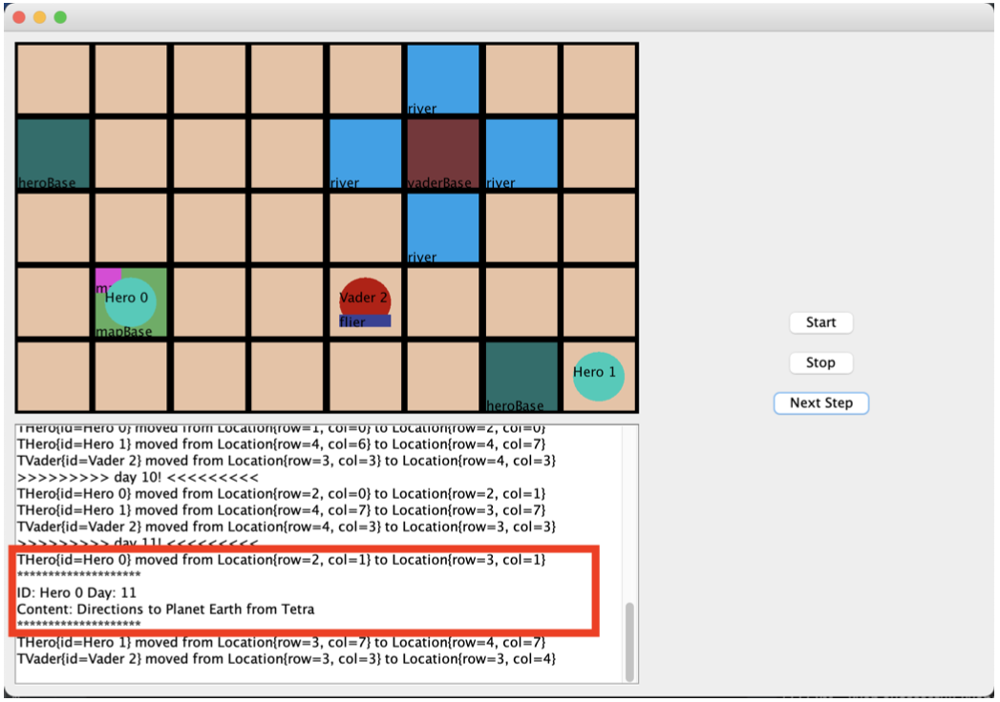
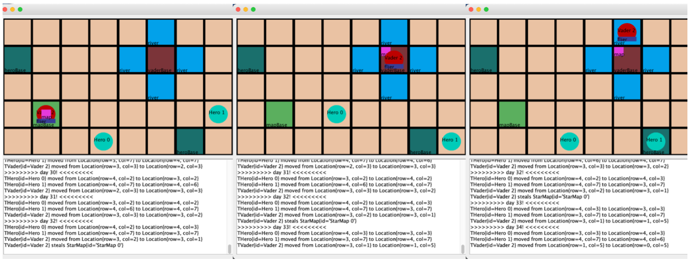
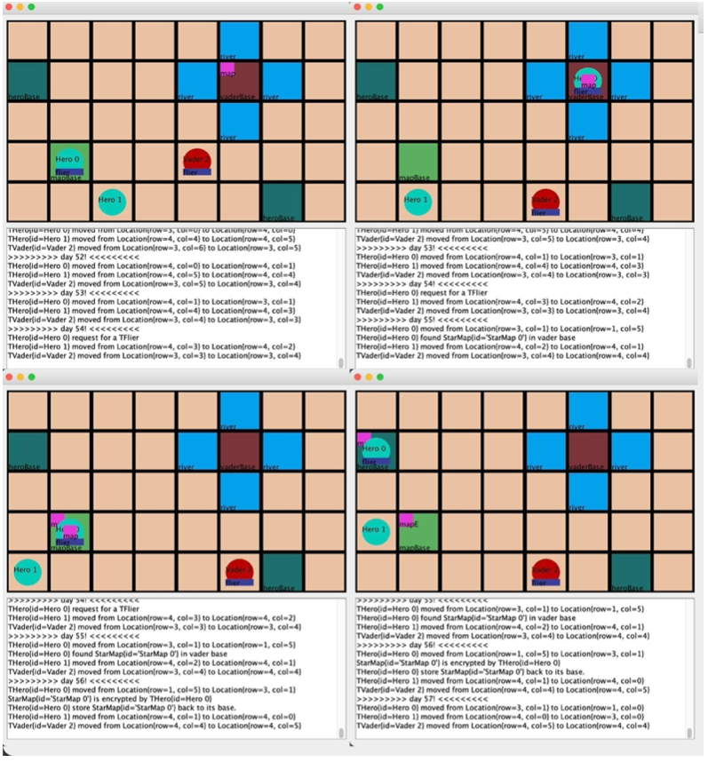
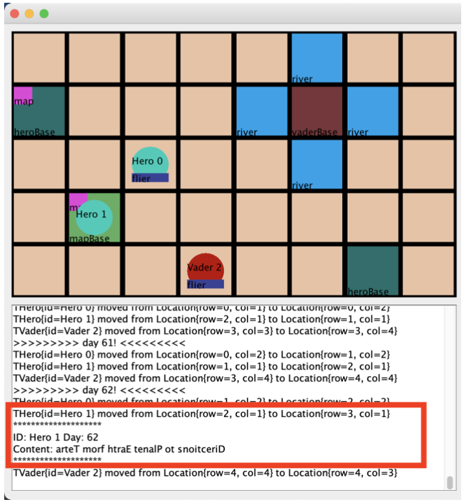

# Tetra Star Simulation

Please refer to [Project Description](./Project%20Description.pdf) for more information.

## Program Launch

Upon launching the program, the client sees an empty simulation board, empty text field, and three simulation control buttons.

## Simulation Start And One Time Step

After pressing the “Start” button, the simulation begins, spawning Heroes, Vaders, Rovers, and MapBases according to the client’s specifications. If the user presses the “Next Step” button, all characters (circles) will take one action, typically moving to an adjacent tile. (It is important to note that the Vader (red) moves up one tile, as it will memorize its moves for later).

## Hero Accesses Map Base

When a hero enters a MapBase that contains a map, the hero will display the contents of the map along with the hero’s ID and the current day (total time step).

## Vader Accesses Map Base

When a vader enters a MapBase, the vader will take the map and instantly move back to the VaderBase and store the map (the vader can instantly move to any tile as the vader has a Flier, represented by the blue rectangle under the vader). After the vader stores the map, the vader will retrace the path taken to reach the MapBase (The vader moves up after storing the map, which is the same movement as noted before for the vader’s first move).

## Hero Retrieves Map

If a hero enters a MapBase and finds that the map is missing, the hero will request a flier, fly to the VaderBase and retrieve the map, encrypt the map and place it back in the MapBase, then store a copy of the unencrypted original in the hero’s base.

## Hero Accesses Map Base With Encrypted Map

As Hero 0 encrypted the map in the MapBase, Hero 1 cannot access its contents but will still display its encrypted details. The encryption method displayed here is a simple string reversal.

